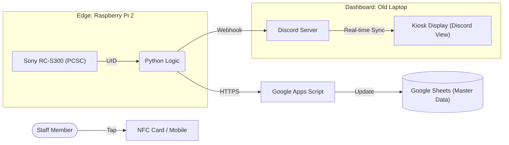

# NFC Attendance & Payroll System (IoT Demo)

An end-to-end IoT solution optimized for high-utility, low-budget deployments using legacy hardware like Raspberry Pi 2 and repurposed laptops for kiosk dashboards.

🇯🇵 日本語による説明を表示する

## システム概要
Raspberry Pi 2 や旧型ラップトップ等の既存資産を活用し、低予算で実用的な現場環境を構築することに特化した、勤怠追跡および自動給与計算の統合ソリューション。

## システムアーキテクチャ
1. **エッジ (Pi 2)**: Sony RC-S300をPCSC経由で制御。低リソース環境下で安定したNFC UIDキャプチャを実行。
2. **ロジック**: Pythonにて状態管理（5分間の連続タッチ防止、15時間タイムアウト）、打刻異常の検知、給与の丸め処理を実装。
3. **バックエンド (GAS)**: HTTPS APIを介してGoogleスプレッドシートへデータを同期し、マスタ管理を実行。
4. **ダッシュボード (旧型PC)**: Discordをキオスク化し、現場へのリアルタイムな打刻フィードバックを提供。

## 主な機能
- **資産の最大活用**: 旧型SBCやラップトップを現役復帰させる、リソース効率の高い設計。
- **打刻の異常検知**: 打刻忘れ、日またぎの勤務、重複スキャンを自動検知しフラグ（`missing_out`, `cross_day`等）を付与。
- **堅牢な同期**: ネットワークの不安定性に備えたAPIリトライロジックの実装。
- **動的ルール適用**: 従業員個別の環境変数ファイルを用いた、時給および丸め単位（分）の柔軟な適用。

## System Architecture
1. **Edge (Pi 2)**: Reliable NFC capture using Sony RC-S300 on low-resource hardware.
2. **Logic**: State management (5-min debounce, 15-hour timeouts), anomaly flagging, and rounding in Python.
3. **Backend (GAS)**: Secure synchronization to Google Sheets for master data management.
4. **Dashboard (Old Laptop)**: Real-time feedback via a Discord-based kiosk display for immediate on-site verification.

## Key Features
- **Resource Optimization**: Designed to run on legacy SBCs and laptops, minimizing deployment costs.
- **Anomaly Detection**: Automatically flags missing check-outs, cross-day shifts, and duplicate scans.
- **Robust Sync**: Built-in API error handling and retry loops for network unreliability.
- **Dynamic Rules**: Employee-specific hourly rates and rounding intervals managed via isolated `.env` files.

## Tech Stack
- **Language**: Python 3.12, JavaScript (GAS)
- **Infrastructure**: Linux (Systemd), Google Apps Script
- **Hardware**: Sony RC-S300/P, Raspberry Pi 2, Repurposed Laptop
