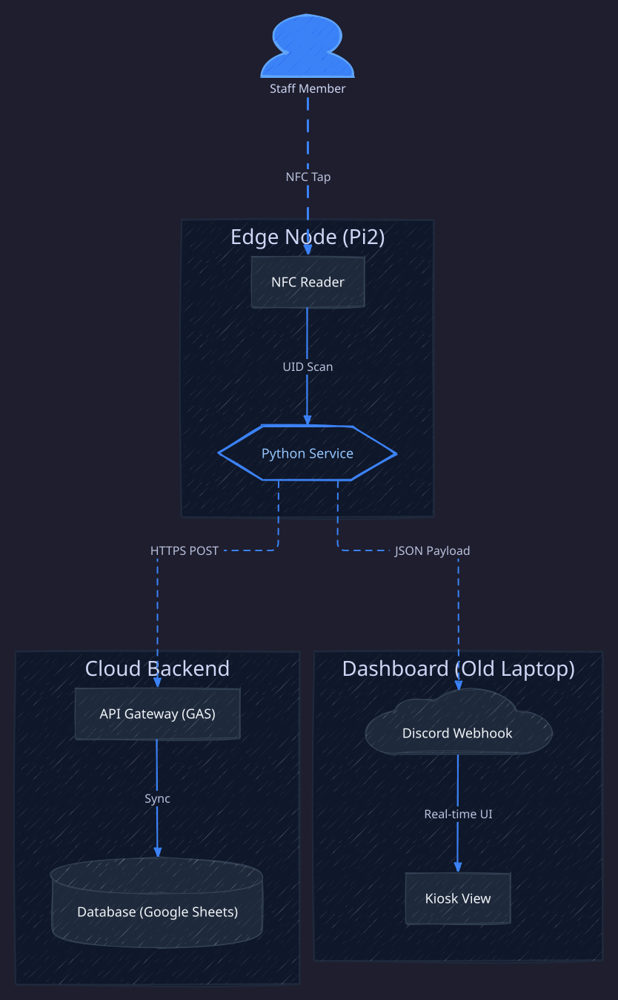

[🇯🇵 日本語](README.md) | [🇬🇧 English](README.en.md)

# NFC Attendance & Payroll System

[](https://github.com/yktsnet/nfc-attendance-kit/actions/workflows/ci.yml)

Sony RC-S300（PaSoRi）と Raspberry Pi を組み合わせた打刻・給与計算システム。
**NFC カードをタッチするだけ**で打刻が完了し、Discord 通知と Google スプレッドシートへの自動集計まで行う。

<p align="center">
  <picture>
    <source media="(min-width: 800px)" srcset="./src/nfc-attendance-kit.svg" width="400">
    
  </picture>
</p>

## Architecture

| コンポーネント | 役割 |
|--------------|------|
| **Edge (Pi 2)** | Sony RC-S300 を PCSC 経由で制御し NFC UID を取得 |
| **ロジック** | 5 分デバウンス・15 時間タイムアウト・日またぎ判定を Python で処理 |
| **バックエンド (GAS)** | HTTPS API 経由で Google スプレッドシートへ同期 |
| **通知** | Discord Webhook でリアルタイムフィードバック |

## Design Principles

- **操作の単純化** — 従業員が覚えることはカードをタッチするだけ
- **既存ハードウェア活用** — Raspberry Pi 2 や旧型 PC で動作。pip 依存なし（標準ライブラリのみ）
- **エラー防止** — デバウンス・タイムアウト・日またぎ判定をすべてシステム側で処理

## Tech Stack

| 区分 | 内容 | Reason |
|-----|------|--------|
| 言語 | Python 3.11+（標準ライブラリのみ） | pip 依存ゼロで Raspberry Pi へのデプロイを簡素化 |
| 言語 | JavaScript（GAS） | Google スプレッドシートとのネイティブ連携 |
| インフラ | Linux systemd user services | root 権限不要、`loginctl enable-linger` で常駐 |
| ハードウェア | Sony RC-S300/P, Raspberry Pi 2 | 既存資産の活用。PC/SC 標準で NFC リーダーを抽象化 |
| 通知 | Discord Webhook | Bot 不要、URL 1 つで導入完了 |

## Design Decisions

- **標準ライブラリのみ**: pip install を排除し、clone → 即実行を実現。Raspberry Pi OS の Python で追加パッケージなしに動く。
- **GAS（Google Apps Script）**: 給与集計先として Google スプレッドシートを選択。専用サーバ・DB を持たず、閲覧・共有・印刷を Google 側に委譲。
- **systemd user services**: root 不要で 1 台〜複数台構成に対応。timer で日次バッチを宣言的に管理。
- **ファイルベースの状態管理（`state/`）**: DB を持たず JSON ログで打刻を永続化。バックアップは `cp` で完結。

## Scope

**Focus:**
- NFC カードによる打刻の検知・記録・通知・給与計算
- 小規模事業所（従業員数十名以下）での運用

**Out of Scope:**
- Web UI / モバイルアプリによる打刻
- クラウド DB（PostgreSQL 等）への移行
- 勤怠の承認ワークフロー・シフト管理

## Requirements

### Hardware

- Sony RC-S300/P（PaSoRi）または PCSC 互換 NFC リーダー
- Raspberry Pi 2 / 任意の Linux PC（Ubuntu 22.04+、Debian 11+、Raspberry Pi OS）

### Software

```bash
sudo apt update
sudo apt install -y pcscd libccid opensc
python3 --version  # 3.11 以上
```

pip 依存はない。Python コードはすべて標準ライブラリのみで動作する。

## Setup

導入は次の流れで進める。各手順の詳細は **[セットアップガイド](./docs/setup.md)** を参照。

1. **Clone & PCSC** — リポジトリを取得し、`pcscd` を起動して NFC リーダーを認識させる。
2. **Secrets** — `config/attendance/` の `.env`（Discord / GAS）を実値で埋める。
3. **カード・社員登録** — `uid_map.json` でカード UID と社員 ID を紐付け、`config/employees/<emp>.env` に氏名・時給を設定する。
4. **systemd Deploy** — 3 サービス（reader / discord / payroll.timer）を user service として常駐させる。
5. **GAS Deploy** — `gas/nfc_reader/` をウェブアプリとして公開し、URL を `gas.env` に設定する。

## Services

| サービス | 役割 | 起動対象 |
|---------|------|---------|
| `attendance-reader` | NFC UID 読み取り・イベントログ書き込み | リーダー接続機 |
| `attendance-discord` | イベントログを tail して Discord 投稿 | 通知表示 PC |
| `attendance-payroll.timer` | 日次給与計算・GAS 同期 | 共有ファイルシステムにアクセスできる機器 |

1 台構成の場合は 3 サービスすべてを同一機で動かせる。

## Adding an Employee

1. `sudo journalctl -fu attendance-reader.service` でログを監視しながら新カードをタッチ
2. `"emp":"unknown"` の JSON に含まれる `uid` の値を確認
3. `config/attendance/uid_map.json` に UID と新しい社員 ID を追記
4. `config/employees/<emp_id>.env` を作成して氏名・時給・丸め単位を設定
5. `sudo systemctl restart attendance-reader.service`（uid_map は起動時に読み込まれるため再起動必須）

時給変更は `emp.env` を編集するだけでよい。給与計算時に都度読み込まれるためサービス再起動は不要。

## Anomaly Flags

`attendance_payroll.py` が出力する給与レコードには、以下のフラグが付与される場合がある。

| フラグ | 意味 |
|-------|------|
| `missing_out` | IN のまま終了（タイムアウト・エラー等） |
| `orphan_out` | 対応する IN なしに OUT を検出 |
| `double_in` | OUT なしに再度 IN を検出 |
| `cross_day` | IN と OUT が日付をまたいでいる |
| `timeout_15h` | 15 時間超の打刻を自動クローズ |
| `day_rollover` | 日付変更時の自動クローズ |
| `missing_hourly_yen` | 社員の時給設定が見つからない |

## Development & Testing

```bash
pip install pytest
pytest
```

テストは `lib/` の 3 モジュール（状態機械・給与計算・ストア）を対象とし、標準ライブラリのみで動作する。CI は push / PR 時に Python 3.11・3.12 でテストを自動実行する。

## How this was built

設計（対話型 AI）・実装（自律型 AI）・検証（人間のマージ）を分離した Issue 駆動で開発している。実装は Issue ファイルを起点に AI エージェントが行い、危険な操作は運用ルールではなく設定で遮断する。仕組みは [dotfiles-public](https://github.com/yktsnet/dotfiles-public) に、過程は本リポジトリの Issue と PR に残している。
